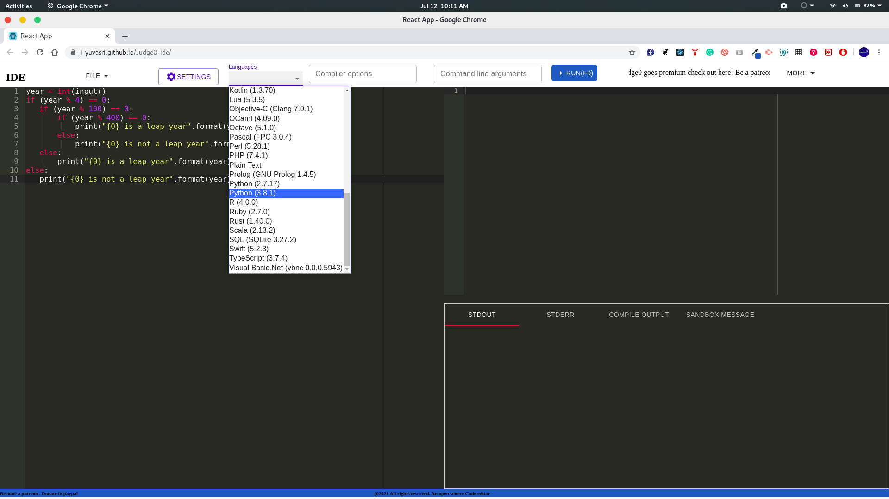
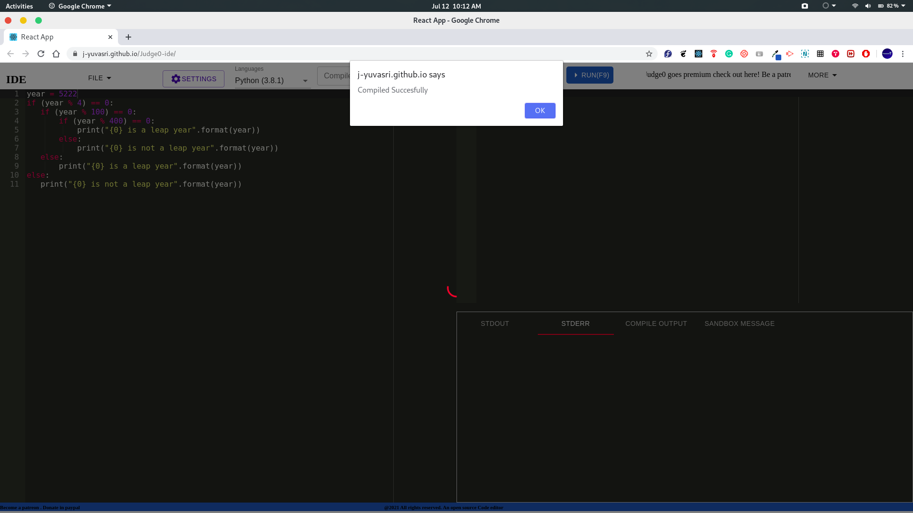
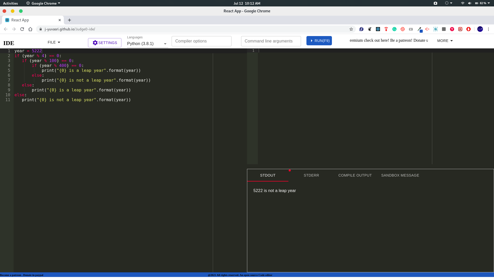
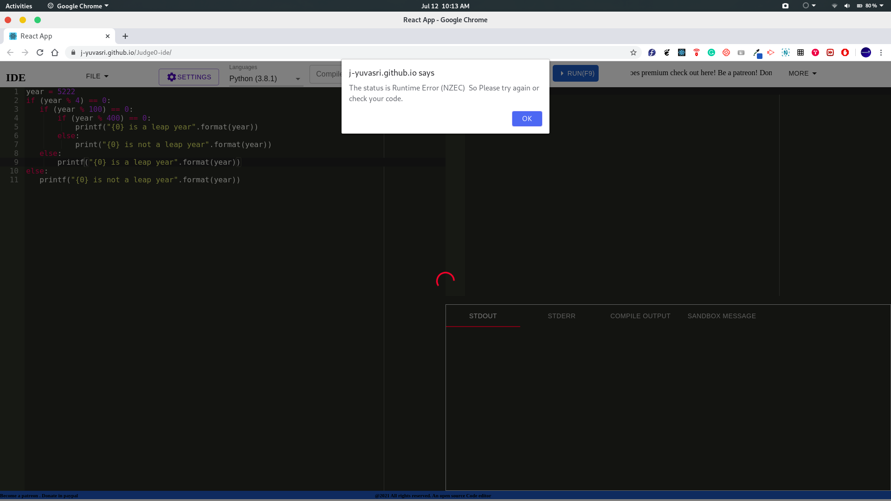
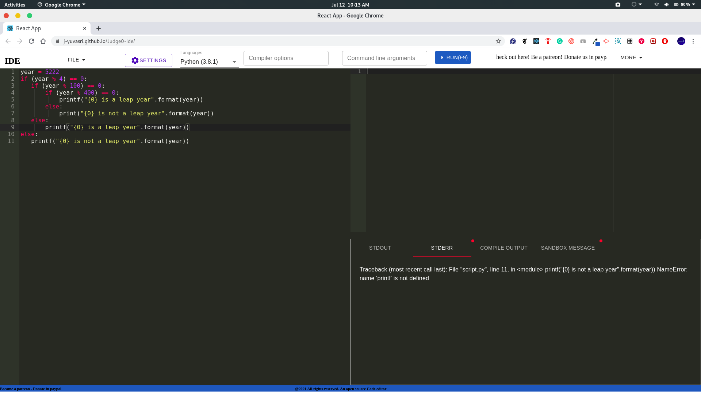

# Online IDE 


## About
This is a clone to the Website https://ide.judge0.com/. It is built using the api from the RapidApi named 
https://rapidapi.com/hermanzdosilovic/api/judge0. This Website is built using reactjs hosted in github pages. 

## To Test
Visit the website https://j-yuvasri.github.io/Judge0-ide/. Type the code in the left side of the editor.



after choosing the language click RUN.If it is successful, you will get an success alert.



You can see the output in the bottom-right and also you could notice that there is an indicator for the tabs which has the messages.

.

If there is any error in our code or the request is not resolved by the server. For Example if the request may be in Processing or InQueue state, there will be no response. You will get an alert according to that.



You could see the the messages in their respective tabs.



This is the successfull flow. Other scenarios will also be notified to you by alert.

## To Install Locally
Git clone or Download as zip file. Open the terminal. 
```bash
npm install
```
This will install all the necessary dependencies for the project.

To use your own api key from RapidAPI. Place your apikey on Line no:96 in App.js

```javascript
 const apikey = "**********************";
 
```
To run locally, type the following command in the terminal.

```bash
  npm start
```
## License
[MIT]
(https://choosealicense.com/licenses/mit/)
